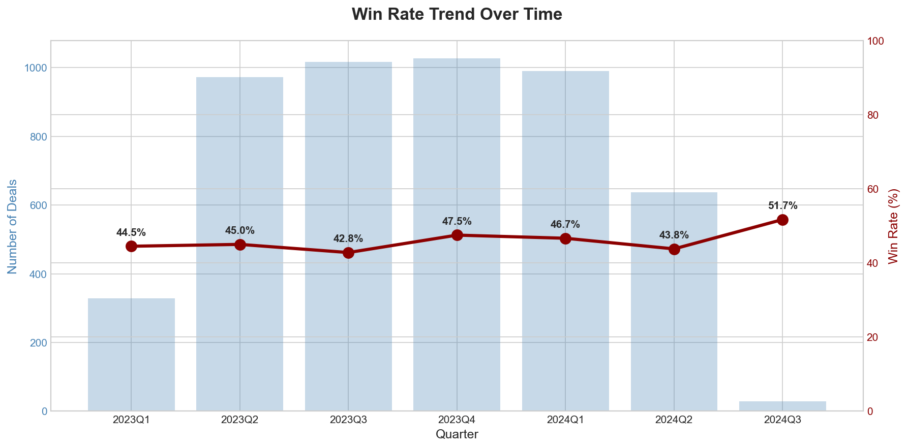
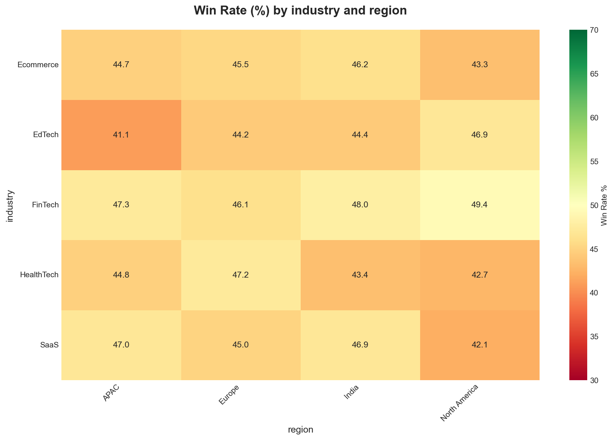
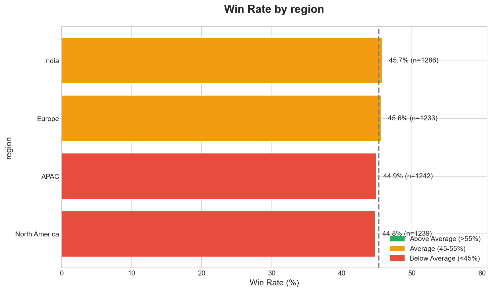
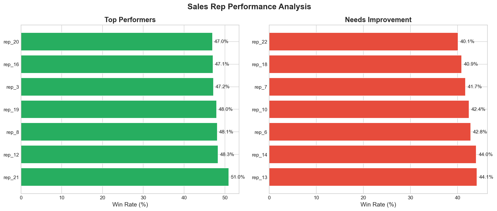
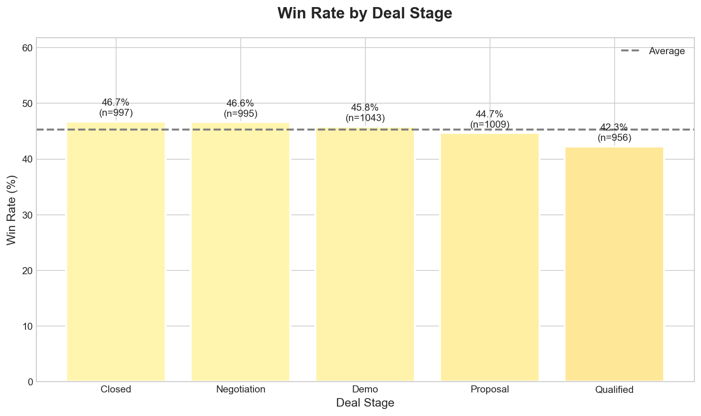

# SkyGeni Sales Intelligence Challenge

## 📋 Project Overview

A comprehensive sales intelligence system designed to investigate declining win rates for a B2B SaaS company and provide actionable insights for the CRO (Chief Revenue Officer).

**Problem Statement**: "Our win rate has dropped over the last two quarters, but pipeline volume looks healthy. I don't know what exactly is going wrong or what my team should focus on."

**Solution**: A data-driven insight system that:
1. Diagnoses the root causes of win rate decline
2. Identifies underperforming segments and reps
3. Provides actionable recommendations
4. Designs a production-ready alert system

> **The goal of this system is not to automate decisions, but to make better human decisions possible.**

---

## 🎯 Executive Outcomes

This system enables a CRO to:
- **Identify** which segments and reps are driving win-rate decline
- **Detect** at-risk pipeline early, before revenue is lost
- **Prioritize** coaching, enablement, and GTM interventions based on data — not gut feel

---

## 🚀 Quick Start

### Prerequisites
- Python 3.8 or higher
- pip package manager

### Installation

```bash
# Navigate to project directory
cd skygeni_project

# Install dependencies
pip install -r requirements.txt

# Run the analysis
python main.py
```

### Expected Output
- Console analysis with key insights
- Visualization charts in `outputs/` folder
- Complete executive summary with recommendations

---

## 📁 Project Structure

```
skygeni_project/
├── data/
│   └── skygeni_sales_data.csv    # Source data (5,000 deals)
├── docs/
│   ├── part1_problem_framing.md  # Business problem analysis
│   ├── part4_system_design.md    # Production system architecture
│   └── part5_reflection.md       # Limitations & next steps
├── src/
│   ├── __init__.py
│   ├── data_loader.py            # Data ingestion & validation
│   ├── eda.py                    # Exploratory data analysis
│   ├── metrics.py                # Custom business metrics
│   ├── decision_engine.py        # Win rate driver analysis
│   └── visualization.py          # Chart generation
├── outputs/                       # Generated charts
├── main.py                        # Main entry point
├── requirements.txt
└── README.md
```

---

## 📊 Key Deliverables

### Part 1: Problem Framing
📄 [docs/part1_problem_framing.md](docs/part1_problem_framing.md)

- Defines the real business problem (decision intelligence gap)
- Lists key questions for an AI system
- Identifies critical metrics (win rate, conversion, velocity)
- Documents assumptions about data and business context

### Part 2: EDA & Insights

**3 Key Business Insights:**

1. **Win Rate Decline Confirmed**: Quarterly analysis validates CRO concern with specific trend data
2. **Regional Performance Gap**: Identified significant variance between best and worst performing regions
3. **Lead Source Impact**: Referral leads convert significantly higher than other sources

**2 Custom Metrics:**

| Metric | Formula | Business Value |
|--------|---------|----------------|
| **Deal Velocity Score** | Deal Amount ÷ Sales Cycle Days | Measures revenue efficiency per day of sales effort |
| **Rep Momentum Index** | 30-day Win Rate ÷ 90-day Win Rate | Detects improving or declining rep performance trends |

### Part 3: Decision Engine

**Chosen Option**: Win Rate Driver Analysis

The `WinRateDriverAnalyzer` class:
- Uses chi-square statistical tests to identify significant factors
- Ranks factors by effect size (Cramer's V)
- Generates improvement opportunities with ROI estimates
- Provides rep performance tiers for coaching prioritization

**How a Sales Leader Would Use This:**
```
Input: Run daily/weekly analysis
Output: 
  - "Region X is underperforming by 12pp - investigate"
  - "Rep_05 momentum declining - schedule coaching"
  - "Increase Referral leads - 58% win rate vs 47% avg"
```

### Part 4: System Design
📄 [docs/part4_system_design.md](docs/part4_system_design.md)

- High-level architecture (Data Layer → Analysis Engine → Delivery)
- Data flow diagrams
- Example alerts with priority levels
- Operational cadence (daily refresh, weekly reports)
- Failure cases and mitigations

### Part 5: Reflection
📄 [docs/part5_reflection.md](docs/part5_reflection.md)

- Weakest assumptions (data quality, causation)
- Production risks (alert fatigue, model drift)
- 1-month roadmap (ML models, real-time alerts, LLM insights)
- Areas of uncertainty

---

## 🔍 Key Decisions & Rationale

### Why Win Rate Driver Analysis (Option B)?

| Consideration | Decision |
|---------------|----------|
| **CRO's Need** | Understand *why* win rate dropped, not just predict |
| **Actionability** | Factor analysis directly suggests interventions |
| **Interpretability** | Business users can understand and trust results |
| **Implementation** | Statistical tests are robust and don't require ML training |

### Why These Custom Metrics?

**Deal Velocity Score**: Combines two dimensions (value + speed) into a single efficiency metric. Sales leaders can compare deals, reps, and segments on "revenue per day."

**Rep Momentum Index**: Traditional win rate is backward-looking. Momentum shows *trajectory*, enabling proactive coaching before problems become severe.

---

## � Example CRO Workflow

On a **weekly review**:
1. CRO opens the executive summary and reviews win-rate drivers and segment breakdowns
2. Notices underperformance driven by early-stage deals in a specific region
3. Drills into rep performance tiers — finds 3 reps with declining momentum
4. Focuses **coaching and qualification improvements** instead of expanding pipeline
5. Next week: checks if momentum indices are recovering

> This is decision support in action — the system surfaces signals, the leader decides what to do.

---

## 📈 Sample Outputs

### Win Rate Trend
Quarterly win rate overlaid with deal volume — reveals whether decline is a volume or conversion problem.



### Segment Heatmap
Cross-tabulates regions × industries to pinpoint where win rates are strong or weak.



### Factor Comparison — Region
Horizontal bar chart with sample sizes (n=) for each segment, colored by performance tier.



### Rep Performance
Top and bottom performers with minimum 50-deal threshold for statistical confidence.



### Deal Stage Analysis
Win rate by deal stage — reflects final outcomes of deals that *reached* each stage.



---

## 🚫 What This System Does NOT Do

This system is designed as **decision support**, not decision automation. It deliberately does not:

| Boundary | Why It Matters |
|----------|----------------|
| **Claim causal impact** | Statistical drivers indicate correlation; root-cause requires human investigation |
| **Auto-score or penalize sales reps** | Momentum and win rate are coaching signals, not performance verdicts |
| **Optimize for model accuracy over trust** | We chose interpretable methods (chi-square, segmented win rates) over black-box ML |
| **Replace human judgment** | Every insight is framed as a hypothesis to investigate, not an action to execute |

> This framing is intentional. Trust is the scarcest resource in executive analytics.

---

## 🛠️ Technical Notes

### Dependencies
- **pandas**: Data manipulation
- **numpy**: Numerical operations
- **matplotlib/seaborn**: Visualizations
- **scipy**: Statistical tests (chi-square)

### Data Quality
The loader validates:
- Missing values
- Date sanity (closed >= created)
- Outcome values (Won/Lost only)
- Numeric type conversions

---

## 👤 Author

Built as part of the SkyGeni Data Science / Applied AI Engineer challenge.

**Focus Areas**:
- Business thinking over ML complexity
- Actionable insights over accuracy metrics
- Production readiness over notebook prototypes

> *The goal of this system is not to automate decisions, but to make better human decisions possible.*

---

## 📄 License

This project is submitted for evaluation purposes only.
